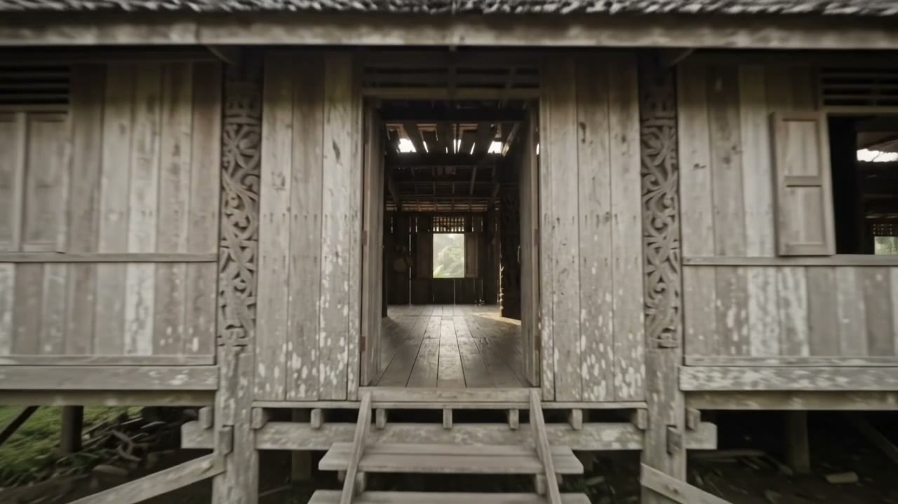

# Long Taa Borneo Eco Stay

> Escape the city. Experience the real Borneo.



Long Taa is a living Sebup longhouse village in Ulu Tinjar, Baram, Sarawak—six
hours by 4WD from Miri. Surrounded by rainforest and the Dapui River, it offers
a community-based experience shaped by nature, culture, adventure, and living
heritage.

This repository contains the digital visitor experience created for the **AI
Business Design Hackathon 2026**.

[**Visit the website**](https://longtaaborneo.vercel.app/) ·
[**Watch the demo**](https://youtube.com/shorts/GQ40pcFxtxI) ·
[**View the slides**](https://canva.link/n2mj20whfgc39l6) ·
[**Download the deck**](https://longtaaborneo.vercel.app/submission/presentation.pdf)

## Why This Project Exists

Long Taa has a compelling story, but planning a remote visit requires more
clarity than a social post or brochure can provide. Before making the journey,
visitors need to understand:

- What Long Taa is—and what it is not
- How to get there and what the journey involves
- Which stays and experiences are available
- What the published costs and travel conditions are
- How to enquire without mistaking an enquiry for a confirmed booking

The project brings those answers into one trustworthy, mobile-friendly place.
It is designed to reduce uncertainty for visitors while keeping final decisions
with the community.

## The Visitor Journey

| Stage | Visitor outcome |
| --- | --- |
| **Discover** | Meet Long Taa through its rainforest, river, longhouse, and people |
| **Understand** | Review accommodation, meals, transport, and published rates |
| **Explore** | Learn about nature, adventure, culture, and living heritage |
| **Respect** | Understand that Long Taa is a living community, not a staged attraction |
| **Plan** | Prepare trip details and send a structured WhatsApp enquiry |

## What We Built

- **Immersive storytelling** — a scroll-led journey from the rainforest canopy
  to the longhouse, supported by authentic community photography
- **Bilingual experience** — visitor content in English and Bahasa Malaysia
- **Clear trip information** — dedicated pages for stays, activities, heritage,
  transport, rates, and travel conditions
- **Planning tool** — an itemised indicative estimate based only on published
  rates, without presenting it as a final quotation
- **Human booking flow** — trip details are prepared for WhatsApp, where the
  community confirms availability, suitability, and final pricing
- **AI visitor assistant** — a Kimi-powered guide for common questions about
  stays, experiences, and planning

## Who It Serves

The experience is intended for nature and adventure lovers, cultural and
heritage travellers, eco-tourists, photographers, researchers, students,
families, and small groups.

It is for people seeking an authentic community experience beyond conventional
tourist routes—not five-star resort tourism.

## Community-First Design

The website follows four principles:

1. **Community ownership leads the story.** Long Taa is presented as a living
   Sebup village, not a tourism set.
2. **Real images carry the experience.** Supplied photography is used instead
   of invented people, places, or activities.
3. **Uncertainty stays visible.** Weather, road, river, safety, and availability
   conditions are clearly stated.
4. **Technology supports conversation.** The website and AI assistant help
   visitors prepare; the community makes the final confirmation.

## Intended Value

For visitors, the experience provides clearer expectations and a simpler path
from discovery to enquiry. For Long Taa, it creates a credible digital home,
makes the experience easier to share, and supports better-informed WhatsApp
conversations.

These are intended outcomes. The project does not claim unmeasured booking,
revenue, visitor, or environmental-impact results.

## Technology

`TanStack Start` · `React 19` · `TypeScript` · `Three.js` · `Vercel AI SDK` ·
`Kimi` · `Vite` · `Vitest` · `Vercel`

## Project Structure

| Path | Contents |
| --- | --- |
| [`landing-page/`](./landing-page/) | Website, visitor assistant, tests, and public assets |
| [`docs/`](./docs/) | Business source material, research, and requirements |
| [`presentation/`](./presentation/) | Pitch deck source, speaker notes, and exports |
| [`video/`](./video/) | Demo video source, script, storyboard, and exports |
| [`PRODUCT.md`](./PRODUCT.md) | Product positioning, constraints, and principles |

## Run Locally

Requires Node.js 22.12 or later.

```bash
cd landing-page
npm ci
npm run dev
```

Open [http://localhost:3000](http://localhost:3000).

The website runs without an AI key. To enable the visitor assistant:

```bash
cp .env.example .env.local
```

Then add your Kimi API key to `.env.local`:

```dotenv
KIMI_API_KEY=your_key_here
```

The key is read only by the server route. Never commit `.env.local` or an API
key.

### Validate

```bash
npm run check
npm run build
```

### Deploy

Import the repository into Vercel, set the root directory to `landing-page`,
and add `KIMI_API_KEY` to the Production and Preview environments if the
visitor assistant should be enabled.

---

**Come as a visitor. Leave with a story.**
