<!-- Converted from LONG TAA BORNEO ECO STAY.docx. Embedded images preserved under assets/long-taa-borneo-eco-stay/. -->

# LONG TAA BORNEO ECO STAY

### Escape the City. Experience the Real Borneo.

Nature • Culture • Adventure • Living Heritage

Deep in the rainforest of Ulu Tinjar, Baram, Sarawak, approximately six hours by 4WD from Miri, lies Long Taa, Dapui—a traditional 20-door longhouse and home of the Indigenous Sebup community.

Surrounded by tropical rainforest and the clear waters of the Dapui River, Long Taa Borneo Eco Stay invites you to leave the noise of the city behind, slow down and discover a different side of Borneo.

Come as a visitor. Leave with a story.

---

### OUR STORY

#### A Living Village, Not a Tourist Resort

Long Taa Borneo Eco Stay was created to share the natural beauty, Indigenous culture and traditional way of life of Long Taa, Dapui with visitors while supporting community-based conservation and sustainable rural development.

Long Taa is not a purpose-built resort. It is a living Sebup village where culture, community and nature remain closely connected.

Despite its remote location, the longhouse has 24-hour solar electricity, fresh mountain-sourced water and telecommunications connectivity. Visitors can therefore experience authentic rural Borneo while retaining access to essential modern conveniences.

Our philosophy is simple:

Protect nature. Respect culture. Share our heritage.

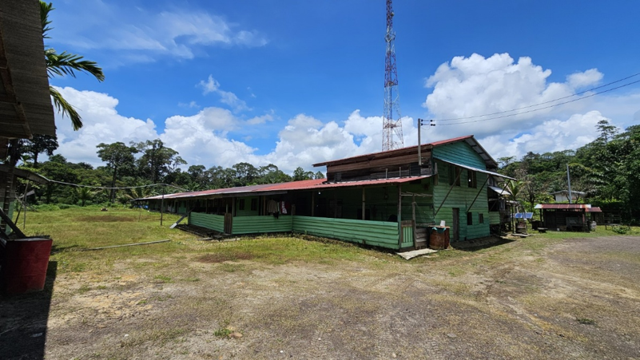

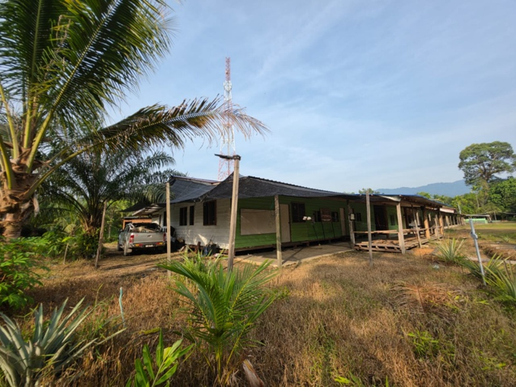

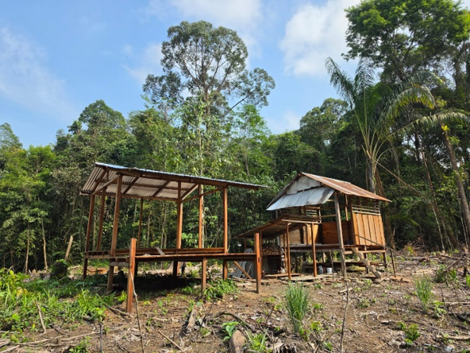

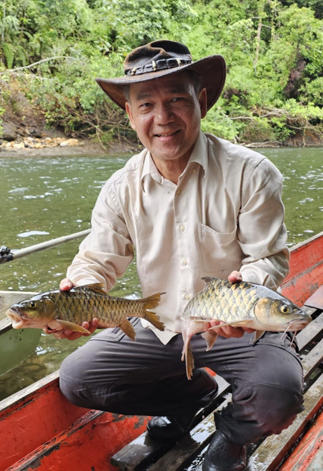

---

### STAY WITH US

#### Experience Authentic Longhouse Living

Long Taa Borneo Eco Stay provides simple and basic accommodation within the longhouse, giving visitors the opportunity to experience everyday rural life rather than conventional hotel tourism.

Wake up to birds calling from the rainforest. Spend your day beside the river, exploring the forest or simply enjoying the fresh air and peaceful surroundings.

At night, there is no traffic and little urban noise. Instead, the sounds of insects, frogs, flowing water and the surrounding forest create Borneo's own natural soundtrack.

#### No traffic. No city noise. Just nature.

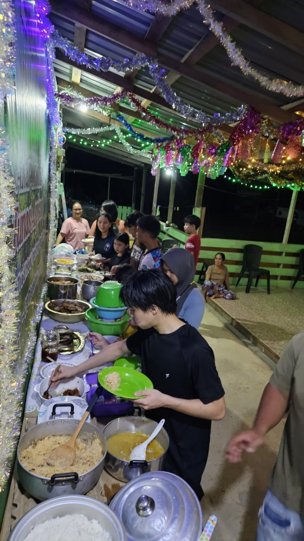

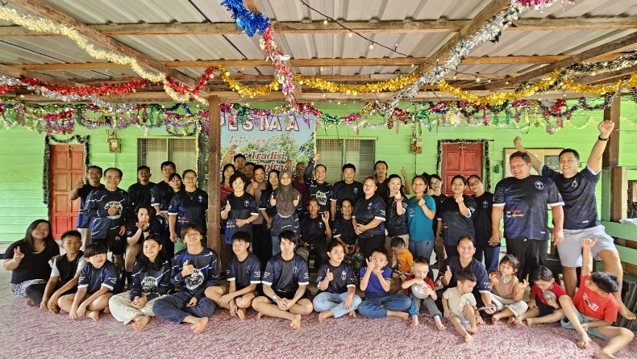

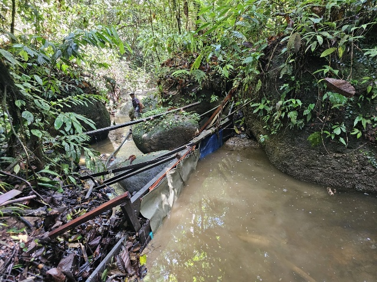

---

### EXPERIENCE LONG TAA

#### Nature • Culture • Adventure

For those who simply want to unwind, Long Taa offers clean air, green surroundings, a clean river and an unhurried village environment.

For adventure seekers, the surrounding landscape offers opportunities for jungle trekking, longboat journeys, river exploration and travelling through sections of the Dapui River rapids.

Visitors can also experience the culture and hospitality of a living Sebup community and discover the close relationship between its people, river, forest and ancestral landscape.

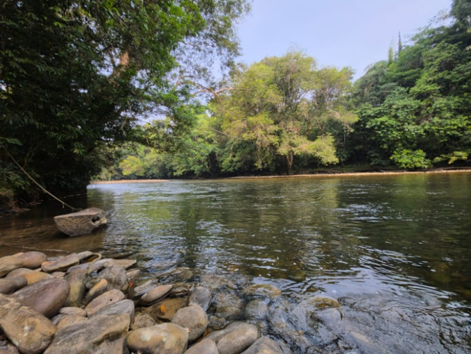

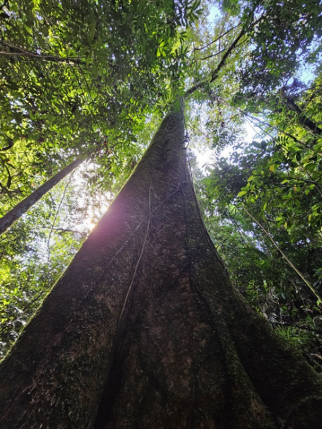

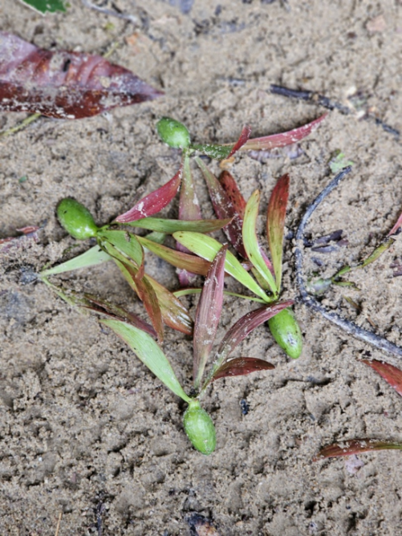

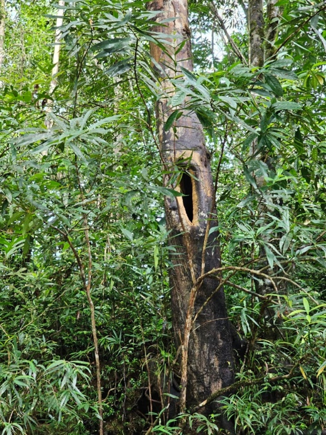

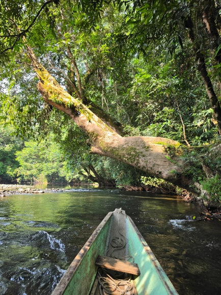

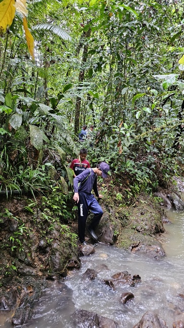

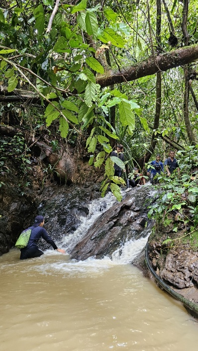

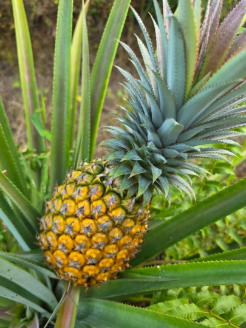

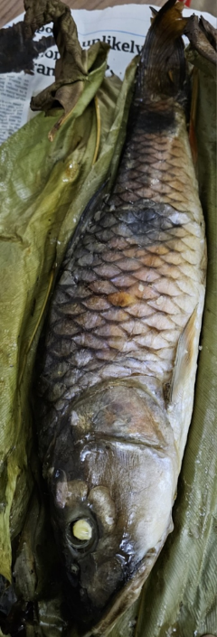

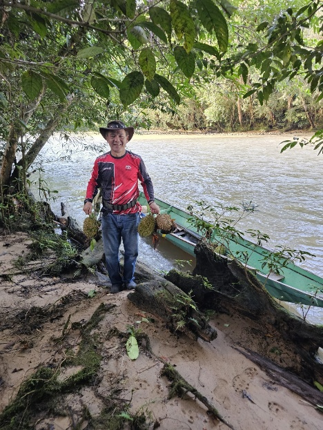

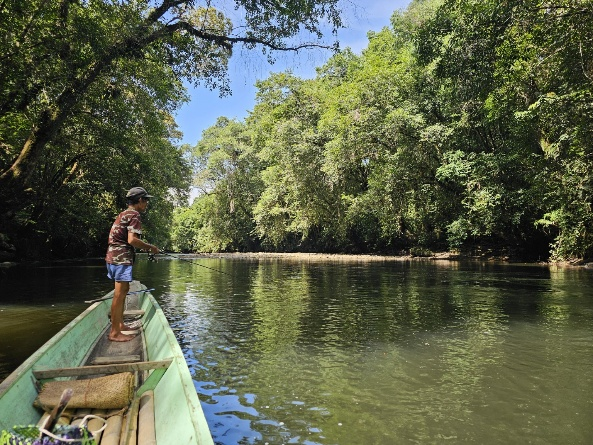

---

### WORK FROM NATURE

#### Your Office Doesn't Always Need Four Walls

For visitors who can work remotely, Long Taa offers an unusual alternative to working from the city.

With 24-hour solar electricity and telecommunications connectivity, you can work while surrounded by rainforest, fresh air and the sounds of nature.

Finish your work, close your laptop—and the river and rainforest are just outside.

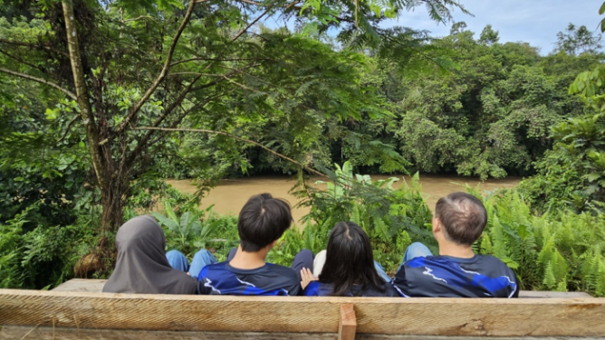

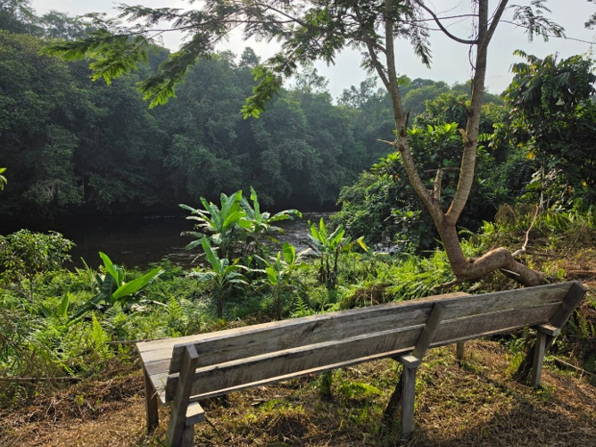

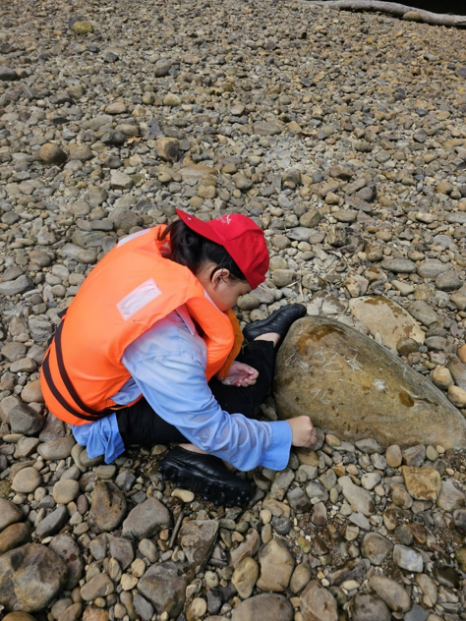

---

### WHO SHOULD VISIT?

Long Taa Borneo Eco Stay is particularly suited to:

Nature lovers • Adventure seekers • Cultural travellers • Eco-tourists • Photographers • Researchers • Remote workers • Families • Small groups • Visitors seeking peace and tranquillity

It is especially suited to travellers who value authentic experiences over luxury and who want to discover a part of Borneo beyond conventional tourist destinations.

---

### WHY LONG TAA?

What makes Long Taa special is not luxury—it is authenticity.

Here you will find a living Indigenous community, rainforest, river, wildlife, traditional knowledge and local hospitality within one landscape.

Our strengths are:

Authentic Sebup longhouse experience
Stay within a living Indigenous community.

Nature at your doorstep
Experience rainforest, river, wildlife and fresh air.

Adventure beyond the ordinary
Explore jungle trails and travel the Dapui River by longboat.

Peace and tranquillity
Escape traffic, crowds and urban noise.

Connected yet remote
Enjoy 24-hour solar electricity and telecommunications connectivity while living close to nature.

Living heritage
Experience a community where Indigenous culture and traditional ecological knowledge continue to be practised and passed to future generations.

---

### GETTING HERE

Destination: Long Taa, Dapui, Ulu Tinjar, Baram, Sarawak, Malaysia

Starting point: Miri, Sarawak

Journey: Approximately 6 hours by 4WD

The journey into Long Taa is part of the experience itself—leaving the city behind and travelling deeper into the interior landscape of Borneo.

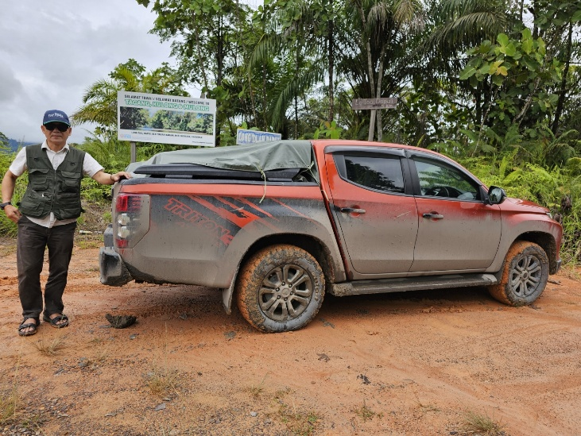

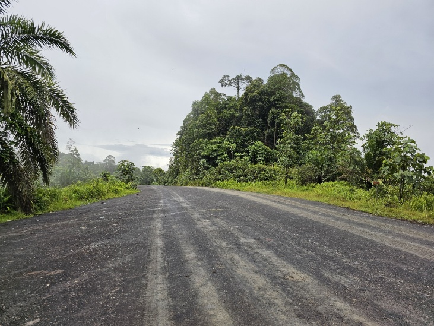

---

## DISCOVER THE BORNEO BEYOND THE ORDINARY

Long Taa is not for travellers looking for five-star luxury.

It is for those searching for something increasingly rare:

A real community.
A living culture.
A clean river.
A green rainforest.
And an adventure worth remembering.

#### Six hours from Miri. A world away from the ordinary.

## LONG TAA BORNEO ECO STAY

#### longtaaborneo.com

Come as a visitor. Leave with a story.

---

### CONTACT & BOOKING

Contact Person: Clement Langet
Mobile / WhatsApp: +60 19-856 3536
Email: longtaaborneo@gmail.com
TikTok: @visitlongtaaborneo
Facebook: @visitlongtaaborneo

Nature • Culture • Adventure • Living Heritage
